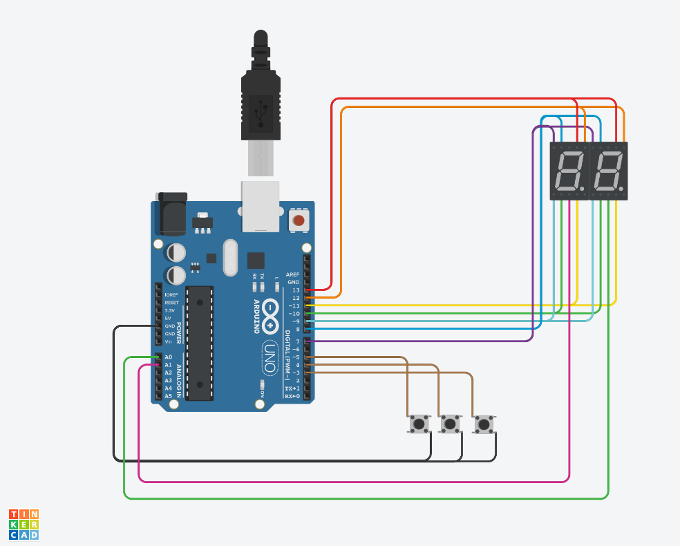

# SPD Parcial domiciliario - Grupo 9

## Integrantes 
- Iván Laurito
- Juan Pablo Ledezma

# Doble display de 7 segmentos

## Parte 1: Contador.

### Descripción
Este circuito controla 2 displays de 7 segmentos para mostrar un número. El mismo está inicializado en 0, y se puede aumentar o disminuir su valor en 1, o resetearlo a 0; pulsando el botón correspondiente.

Para mostrar controlar los 2 display con una única salida, se utiliza la técnica de la multiplexación, la cual consiste en encender un display por un instante, luego apagarlo y encerder el otro, repitiendo este proceso varias veces por segundo. De esta manera se logra engañar al ojo humano, el cuál percibe que ambos displays están encendidos al mismo tiempo.

La configuración de los displays es cátodo común.

### Funciones principales
Estas son las funciones que se encargan de la multiplexación.

UNIDADES es un #define del pin de salida que está conectado al cátodo del display derecho (el que muestra las unidades), mientras que DECENAS es el pin conectado al cátodo del display izquierdo (que muestra las decenas).

La función encenderDisplays recibe como parámetro la posición del número que será mostrado; si la misma es UNIDADES, se enciende el display derecho y se apaga el izquierdo, caso contrario se enciende el display izquierdo y se apaga el derecho.

La función mostrarNumero recibe como parámetro al número de 2 cifras que será mostrado. Comienza apagando ambos displays, a continuación, usa el operador módulo "%" para obtener el resto entre la división del número ingresado y 10, para así separar las unidades, y selecciona los segmentos correspondientes del display. Luego, llama a la función encenderDisplays para prender el display de las unidades. Después, vuelve a apagar ambos displays y vuelve a hacer los mismo, pero esta vez para las decenas. Para separar las decenas de las unidades, se divide al número por 10. Las unidades quedarían en la parte fraccionaria luego de la división, y al estar usando números enteros, se truncaría el resultado, quedando solo con las decenas.

~~~ C
void mostrarNumero(int num) {
  digitalWrite(UNIDADES, HIGH);
  digitalWrite(DECENAS, HIGH);
  encenderNumero(num % 10);
  encenderDisplays(UNIDADES);
  digitalWrite(UNIDADES, HIGH);
  digitalWrite(DECENAS, HIGH);
  encenderNumero(num / 10);
  encenderDisplays(DECENAS);
}

void encenderDisplays(int posicion)
{
  if (posicion == UNIDADES)
  {
    digitalWrite(UNIDADES, LOW);
    digitalWrite(DECENAS, HIGH);
    delay(DELAY);
  }
  else
  {
    digitalWrite(DECENAS, LOW);
    digitalWrite(UNIDADES, HIGH);
    delay(DELAY);
  }
}
~~~

## Parte 2: Implementación de números primos.

### Descripción
Este circuito consta de 2 displays que que muestran el número ingresado por el usuario mediante los componentes. Presenta
dos modos de ingreso del valor númerico: por medio de los botones y acorde al valor devuelto por el sensor de temperatura
que oscila entre los -40ºC y los 125ºC.

Si el interruptor del switch de ingreso se encuentra hacia su izquierda, se hallará en modo Botones. Este modo permite
usar los botones para aumentar, disminuir y resetar el contador del número mostrado en los displays al mínimo. En este
modo, si el switch está en estado HIGH, funciona como un contador lineal, que cambia su valor en 1 por cada pulsación.
Si está en estado LOW, el contador calcula el próximo número primo, en caso que se presione el botón "Aumentar"; o el anterior número primo, en caso que se presione el botón "Disminuir".

Si el interruptor del switch de ingreso se encuentra hacia su derecha, se hallará en modo Sensor. Este modo devolverá el
número de 0 a 99 a mostrarse en los displays según el valor obtenido del sensor de temperatura. Además, en este modo se
activará el motor en una frecuencia equivalente al valor del sensor de temperatura, siendo su valor mínimo equivalente a 0 rpm y su valor máximo equivaente a 2941 rpm.

### Función principal
La función toma como argumento un número entero, y devuelve `true` si el número es primo, o `false` si el número NO es primo.

~~~ C
bool esPrimo(int numero) {
  // No existen números primos menores a 2.
  if (numero < 2) {
    return false;
  }
  /*
   * Se buscan divisores del número, entre 2 (el número primo más pequeño), 
   * y la mitad del número (los números superiores a su mitad no pueden ser divisores).
   * Si encuentra un divisor, se devuelve false.
   */
  for (int i = 2; i <= (numero / 2); i++) {
    if (numero % i == 0) {
    return false;
    }
  }
  return true;
}
~~~

## :robot: Link al proyecto
- [Parte 1](https://www.tinkercad.com/things/is7XQ8Ry0C8)
- [Parte 2](https://www.tinkercad.com/things/bnREgVTIRfq)
